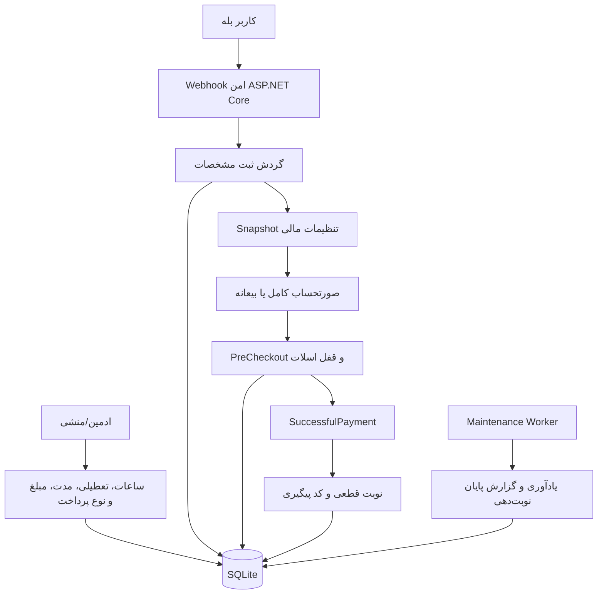

# سیستم نوبت‌گیری مطب دکتر قاسم‌زاده

بازوی نوبت‌دهی مطب برای پیام‌رسان بله، نوشته‌شده با C# و ASP.NET Core 8. بیمار اطلاعات هویتی و بیمه را تکمیل می‌کند، طبق تنظیمات مطب مبلغ کامل یا بیعانه را با کیف پول بله می‌پردازد و اولین زمان خالی را همراه کد پیگیری دریافت می‌کند.

## امکانات

- ورود بدون رمز با شناسه حساب بله
- ثبت درخواست فقط در بازه روزانه قابل تنظیم محیط، با مقدار پیش‌فرض ۱۴:۰۰ تا ۱۴:۳۰ به وقت تهران
- ادامه فرم آغازشده تا ۳۰ دقیقه برای جلوگیری از ناقص‌ماندن ثبت نزدیک پایان بازه
- دریافت و اعتبارسنجی نام بیمار، کد ملی، تاریخ تولد، موبایل، بیمه، شماره بیمه و علت مراجعه
- تنظیم مدت هر بیمار از داخل پنل مدیریت، بدون Deploy مجدد
- تنظیم مبلغ کل ویزیت از داخل پنل مدیریت
- انتخاب روش پرداخت «کامل» یا «بیعانه» و تنظیم مبلغ بیعانه از داخل پنل
- ثبت Snapshot شرایط مالی روی هر نوبت؛ تغییر تنظیمات، فاکتورهای قبلی را تغییر نمی‌دهد
- کنترل مجدد ظرفیت در `PreCheckoutQuery` و قطعی‌سازی فقط پس از `SuccessfulPayment`
- رزرو اتمیک اولین ساعت خالی و بررسی هم‌پوشانی کامل بازه زمانی نوبت‌ها
- برنامه هفتگی قابل تنظیم توسط ادمین/منشی، با پشتیبانی از شیفت عبوری از نیمه‌شب
- برنامه اولیه: شنبه تا چهارشنبه ۱۷:۰۰ تا ۰۱:۰۰، پنج‌شنبه ۱۷:۰۰ تا ۲۲:۰۰، جمعه تعطیل
- تعطیل‌کردن یک تاریخ خاص با تاریخ شمسی
- پیگیری نوبت و صدور کد رهگیری
- فهرست نوبت‌های امروز، آمار مالی و لغو نوبت برای ادمین
- گزارش کامل رزروها شامل مشخصات بیمار، بیمه، علت مراجعه، ساعت، مبلغ پرداخت‌شده و مانده
- ارسال خودکار گزارش کامل روز پس از پایان بازه نوبت‌دهی، فقط یک بار برای هر روز
- یادآوری خودکار ۲۴ ساعت و ۲ ساعت قبل از نوبت
- ارتقای خودکار Schema دیتابیس‌های SQLite قبلی برای تنظیمات جدید
- پردازش idempotent آپدیت‌ها، مسیر وب‌هوک محرمانه و عدم نگهداری توکن در سورس
- SQLite، Docker، Health Check، تست خودکار، CI و Dependabot

## معماری کوتاه



## پیش‌نیازها

- یک بازو در بله و توکن آن
- توکن پرداخت کیف پول بله
- یک سرور دارای Docker و یک آدرس عمومی HTTPS
- دامنه‌ای که به سرور اشاره کند

برای پرداخت آزمایشی می‌توان از توکن رسمی زیر استفاده کرد؛ این توکن پول واقعی جابه‌جا نمی‌کند:

```text
WALLET-TEST-1111111111111111
```

## راه‌اندازی

```bash
git clone https://github.com/shervinq/MedicalAppointmentOffice.git
cd MedicalAppointmentOffice
cp .env.example .env
```

در `.env` حداقل این مقادیر را تنظیم کنید:

```dotenv
BALE__TOKEN=توکن-بازو
BALE__PAYMENTPROVIDERTOKEN=WALLET-TEST-1111111111111111
BALE__PUBLICBASEURL=https://bot.example.com
BALE__WEBHOOKSECRET=یک-رشته-تصادفی-حداقل-۳۲-کاراکتری
BALE__ADMINUSERIDS__0=شناسه-عددی-شما
```

سپس:

```bash
docker compose up -d --build
docker compose logs -f
curl http://localhost:8080/health
```

اگر شناسه عددی بله خود را نمی‌دانید، داخل بازو `/id` بفرستید و مقدار نمایش‌داده‌شده را در `BALE__ADMINUSERIDS__0` قرار دهید.

## تست بدون انتظار تا ساعت ۱۴

فقط در محیط آزمایشی می‌توانید موقتاً بازه ورود را باز کنید:

```dotenv
BOOKING__ENTRYWINDOWSTART=00:00
BOOKING__ENTRYWINDOWEND=23:59
```

پس از تست این override را حذف کنید.

## مدیریت داخل بله

فرمان `/admin` یا دکمه «مدیریت مطب» پنل را باز می‌کند.

| عملیات | روش |
|---|---|
| تنظیم مدت هر بیمار | «تنظیمات نوبت‌دهی» ← «مدت هر بیمار» ← عدد دقیقه، از ۵ تا ۲۴۰ |
| تنظیم مبلغ کل | «تنظیمات نوبت‌دهی» ← «مبلغ ویزیت» ← مبلغ به تومان |
| پرداخت کامل/بیعانه | «تنظیمات نوبت‌دهی» ← «نوع پرداخت» |
| تنظیم مبلغ بیعانه | «تنظیمات نوبت‌دهی» ← «مبلغ بیعانه» ← مبلغ به تومان |
| تغییر ساعت هفتگی | «ساعات هفتگی» ← انتخاب روز ← ورود `17:00-01:00` |
| تعطیل‌کردن یک روز هفته | در ساعت همان روز بنویسید `تعطیل` |
| تعطیل‌کردن یک تاریخ | «تعطیلی تاریخ» ← ورود تاریخ شمسی مثل `۱۴۰۵/۰۵/۲۱` |
| بازکردن تاریخ تعطیل | `/open ۱۴۰۵/۰۵/۲۱` |
| مشاهده نوبت‌های امروز | «نوبت‌های امروز» |
| گزارش کامل رزروهای روز | «گزارش کامل رزروها» |
| لغو نوبت | `/cancel GZ-12345678 علت لغو` |
| آمار مالی | «آمار» |

شیفت `17:00-01:00` به‌صورت ۱۷ همان روز تا ۱ بامداد روز بعد محاسبه می‌شود.

### رفتار پرداخت بیعانه

در حالت بیعانه، فقط مبلغ بیعانه در بله دریافت می‌شود و نوبت پس از پرداخت قطعی می‌شود. مبلغ باقی‌مانده در پیام تأیید بیمار، پیگیری نوبت، گزارش منشی و آمار مالی نمایش داده می‌شود و به‌عنوان مانده قابل پرداخت در مطب در نظر گرفته می‌شود. تغییر مبلغ یا نوع پرداخت بعداً روی نوبت‌هایی که قبلاً ساخته شده‌اند اثر نمی‌گذارد.

### گزارش پایان بازه نوبت‌دهی

Worker پس از پایان `Booking:EntryWindowEnd` گزارش رزروهای قطعی همان روز را برای تمام `AdminUserIds` ارسال می‌کند. تاریخ آخرین گزارش در دیتابیس ثبت می‌شود تا با loop یا restart سرویس، گزارش همان روز دوباره ارسال نشود.

## اجرای مستقیم با .NET

```bash
dotnet restore
dotnet test
dotnet run --project src/MedicalAppointmentOffice
```

## داده‌ها، پشتیبان و امنیت

- فایل دیتابیس در Volume نام‌دار `appointment-data` نگهداری می‌شود و با Restart کانتینر از بین نمی‌رود.
- از Volume به‌صورت دوره‌ای پشتیبان رمزگذاری‌شده بگیرید؛ اطلاعات بیمار داده حساس است.
- دسترسی SSH، فایل `.env` و بکاپ را محدود کنید.
- لغو نوبت، زمان را آزاد می‌کند اما بازپرداخت وجه خودکار نیست و باید طبق روال مطب انجام شود.
- برای اجرای چند Replica، SQLite مناسب نیست؛ در آن حالت PostgreSQL و یک استراتژی قفل توزیع‌شده توصیه می‌شود.
- قبل از استفاده واقعی، متن رضایت، سیاست نگهداری اطلاعات، قوانین لغو و الزامات حقوقی/مالی مطب را نهایی کنید.

## تنظیمات Bootstrap/Environment

مقادیر زیر Default اولیه و تنظیمات فنی هستند. `PriceRials` و `SlotMinutes` فقط برای مقدار اولیه `ClinicSettings` استفاده می‌شوند و پس از ایجاد دیتابیس، منشی آن‌ها را از داخل پنل تغییر می‌دهد.

| کلید | مقدار پیش‌فرض | توضیح |
|---|---:|---|
| `Booking:PriceRials` | `5000000` | مبلغ اولیه ویزیت، بر حسب ریال |
| `Booking:SlotMinutes` | `15` | مدت اولیه هر نوبت |
| `Booking:EntryWindowStart` | `14:00` | شروع ثبت روزانه |
| `Booking:EntryWindowEnd` | `14:30` | پایان ثبت روزانه و زمان فعال‌شدن گزارش روز |
| `Booking:SearchDays` | `60` | تعداد روزهای آینده برای یافتن ساعت خالی |
| `Booking:ReservationMinutes` | `15` | مهلت قفل اسلات هنگام پرداخت |
| `Booking:SessionMinutes` | `30` | مهلت تکمیل فرمی که در بازه مجاز شروع شده |

## منابع رسمی بله

- [مستندات API بازوهای بله](https://docs.bale.ai/)
- [بخش آموزش‌های توسعه بازو](https://docs.bale.ai/courses)
