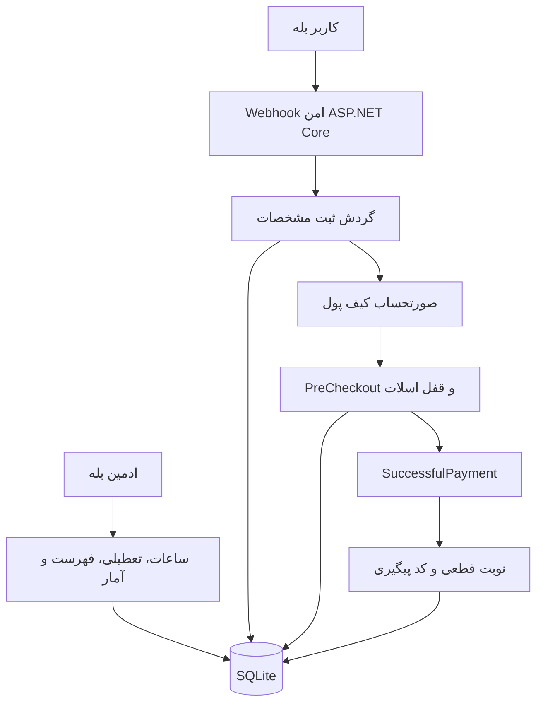

# سیستم نوبت‌گیری مطب دکتر قاسم‌زاده

بازوی حرفه‌ای نوبت‌دهی مطب برای پیام‌رسان بله، نوشته‌شده با C# و ASP.NET Core 8. بیمار مشخصات و اطلاعات بیمه را در گفت‌وگو تکمیل می‌کند، مبلغ ۵۰۰٬۰۰۰ تومان را با کیف پول بله می‌پردازد و اولین زمان ۱۵ دقیقه‌ای خالی را همراه کد پیگیری دریافت می‌کند.

## امکانات

- ورود بدون رمز با شناسه حساب بله
- ثبت درخواست فقط هر روز بین ساعت ۱۴:۰۰ تا ۱۴:۳۰ به وقت تهران
- ادامه فرم آغازشده تا ۳۰ دقیقه برای جلوگیری از ناقص‌ماندن ثبت ساعت ۱۴:۲۹
- دریافت و اعتبارسنجی نام بیمار، کد ملی، تاریخ تولد، موبایل، بیمه، شماره بیمه و علت مراجعه
- پرداخت رسمی کیف پول بله با مبلغ ۵٬۰۰۰٬۰۰۰ ریال
- کنترل مجدد ظرفیت در `PreCheckoutQuery` و قطعی‌سازی فقط پس از `SuccessfulPayment`
- رزرو اتمیک اولین ساعت خالی و جلوگیری از اختصاص یک زمان به دو بیمار
- برنامه هفتگی قابل تنظیم توسط ادمین، با پشتیبانی از شیفت عبوری از نیمه‌شب
- برنامه اولیه: شنبه تا چهارشنبه ۱۷:۰۰ تا ۰۱:۰۰، پنج‌شنبه ۱۷:۰۰ تا ۲۲:۰۰، جمعه تعطیل
- تعطیل‌کردن یک تاریخ خاص با تاریخ شمسی
- پیگیری نوبت و صدور کد رهگیری
- فهرست نوبت‌های امروز، آمار و لغو نوبت برای ادمین
- یادآوری خودکار ۲۴ ساعت و ۲ ساعت قبل از نوبت
- پردازش idempotent آپدیت‌ها، مسیر وب‌هوک محرمانه و عدم نگهداری توکن در سورس
- SQLite، Docker، Health Check، تست خودکار، CI و Dependabot

## معماری کوتاه



## پیش‌نیازها

- یک بازو در بله و توکن آن
- توکن پرداخت کیف پول بله
- یک سرور دارای Docker و یک آدرس عمومی HTTPS
- دامنه‌ای که به سرور اشاره کند (برای محیط واقعی)

طبق مستندات رسمی، درخواست‌های API بله به `https://tapi.bale.ai/bot<TOKEN>/METHOD` ارسال می‌شوند و وب‌هوک باید HTTPS باشد. برای پرداخت آزمایشی می‌توان از توکن رسمی زیر استفاده کرد؛ این توکن پول واقعی جابه‌جا نمی‌کند:

```text
WALLET-TEST-1111111111111111
```

## ۱. ساخت بازو در بله

1. در بله وارد `@botfather` شوید.
2. یک بازوی جدید با نام نمایشی **سیستم نوبت گیری مطب دکتر قاسم زاده** بسازید و توکن بازو را دریافت کنید.
3. از بخش پرداخت BotFather، توکن کیف پول بازو را بگیرید. تا زمان تست از توکن آزمایشی بالا استفاده کنید.
4. توکن‌ها را فقط در متغیرهای محیطی قرار دهید؛ آن‌ها را داخل `appsettings.json` یا Git کامیت نکنید.

## ۲. اجرای محلی با Docker

```bash
git clone https://github.com/shervinq/MedicalAppointmentOffice.git
cd MedicalAppointmentOffice
cp .env.example .env
```

در فایل `.env` این مقادیر را تنظیم کنید:

```dotenv
BALE__TOKEN=توکن-بازو
BALE__PAYMENTPROVIDERTOKEN=WALLET-TEST-1111111111111111
BALE__PUBLICBASEURL=https://bot.example.com
BALE__WEBHOOKSECRET=یک-رشته-تصادفی-حداقل-۳۲-کاراکتری
BALE__ADMINUSERIDS__0=شناسه-عددی-شما
```

برای ساخت Secret امن در لینوکس:

```bash
openssl rand -hex 32
```

سپس اجرا کنید:

```bash
docker compose up -d --build
docker compose logs -f
```

وضعیت سرویس:

```bash
curl http://localhost:8080/health
```

اگر `PublicBaseUrl` و توکن تنظیم باشند، برنامه هنگام بالا آمدن وب‌هوک را خودکار در بله ثبت می‌کند.

## ۳. پیدا کردن شناسه ادمین

اگر شناسه عددی بله خود را نمی‌دانید، بار اول `BALE__ADMINUSERIDS__0` را از `.env` حذف کنید، برنامه را بالا بیاورید و داخل بازو پیام `/id` بفرستید. عدد نمایش‌داده‌شده را در `.env` قرار دهید و سرویس را بازسازی کنید:

```bash
docker compose up -d --force-recreate
```

دسترسی ادمین فقط با همین شناسه عددی کنترل می‌شود؛ نام یا نام کاربری قابل جعل مبنای دسترسی نیست.

## ۴. تست سریع بدون انتظار تا ساعت ۱۴

قانون واقعی ثبت، ۱۴:۰۰ تا ۱۴:۳۰ است. فقط در محیط آزمایشی دو خط زیر را موقتاً به `.env` اضافه کنید:

```dotenv
BOOKING__ENTRYWINDOWSTART=00:00
BOOKING__ENTRYWINDOWEND=23:59
```

پس از تست حتماً آن‌ها را حذف و سرویس را دوباره ایجاد کنید. با توکن `WALLET-TEST...` پرداخت شبیه‌سازی می‌شود و وجه واقعی انتقال نمی‌یابد.

سناریوی تست پیشنهادی:

1. `/start` را برای بازو بفرستید.
2. «دریافت نوبت» را بزنید و فرم بیمار را کامل کنید.
3. صورتحساب آزمایشی ۵۰۰ هزار تومانی را تأیید کنید.
4. ساعت، کد پیگیری و کد تراکنش را بررسی کنید.
5. «پیگیری نوبت» را بزنید.
6. با حساب ادمین، «نوبت‌های امروز» و «آمار» را بررسی کنید.

## ۵. مدیریت داخل بله

فرمان `/admin` یا دکمه «مدیریت مطب» منوی ادمین را باز می‌کند.

| عملیات | روش |
|---|---|
| تغییر ساعت هفتگی | «ساعات هفتگی» ← انتخاب روز ← ورود `17:00-01:00` |
| تعطیل‌کردن یک روز هفته | در ساعت همان روز بنویسید `تعطیل` |
| تعطیل‌کردن یک تاریخ | «تعطیلی تاریخ» ← ورود تاریخ شمسی مثل `۱۴۰۵/۰۵/۲۱` |
| بازکردن تاریخ تعطیل | `/open ۱۴۰۵/۰۵/۲۱` |
| لغو نوبت | `/cancel GZ-12345678 علت لغو` |
| مشاهده برنامه روز | دکمه «نوبت‌های امروز» |
| آمار کل | دکمه «آمار» |

شیفت `17:00-01:00` به‌درستی به‌صورت ۱۷ همان روز تا ۱ بامداد روز بعد محاسبه می‌شود.

## ۶. استقرار روی VPS

روی یک VPS لینوکسی:

1. Docker و Docker Compose را نصب کنید.
2. ریپو را Clone و `.env` را مانند بخش قبل تکمیل کنید.
3. با `docker compose up -d --build` سرویس را اجرا کنید.
4. پورت ۸۰۸۰ را فقط پشت یک Reverse Proxy مثل Nginx یا Caddy قرار دهید.
5. برای دامنه گواهی TLS معتبر بگیرید و `BALE__PUBLICBASEURL` را برابر همان آدرس HTTPS بگذارید.

نمونه بخش اصلی Nginx:

```nginx
server {
    listen 443 ssl http2;
    server_name bot.example.com;

    ssl_certificate /etc/letsencrypt/live/bot.example.com/fullchain.pem;
    ssl_certificate_key /etc/letsencrypt/live/bot.example.com/privkey.pem;

    location / {
        proxy_set_header Host $host;
        proxy_set_header X-Forwarded-Proto $scheme;
        proxy_set_header X-Forwarded-For $proxy_add_x_forwarded_for;
        proxy_pass http://127.0.0.1:8080;
    }
}
```

بعد از تغییر دامنه یا Secret، کانتینر را دوباره ایجاد کنید تا وب‌هوک جدید ثبت شود.

## اجرای مستقیم با .NET

```bash
dotnet restore
dotnet test
dotnet run --project src/MedicalAppointmentOffice
```

برای نگهداری Secret در محیط توسعه می‌توانید از User Secrets استفاده کنید:

```bash
dotnet user-secrets --project src/MedicalAppointmentOffice set "Bale:Token" "..."
dotnet user-secrets --project src/MedicalAppointmentOffice set "Bale:WebhookSecret" "..."
```

## داده‌ها، پشتیبان و امنیت

- فایل دیتابیس در Volume نام‌دار `appointment-data` نگهداری می‌شود و با Restart کانتینر از بین نمی‌رود.
- از Volume به‌صورت دوره‌ای پشتیبان رمزگذاری‌شده بگیرید؛ اطلاعات بیمار داده حساس است.
- دسترسی SSH، فایل `.env` و بکاپ را محدود کنید.
- لغو نوبت در برنامه زمان را آزاد می‌کند، اما **بازپرداخت وجه خودکار نیست** و باید طبق روال مطب انجام شود.
- برای اجرای هم‌زمان چند Replica، SQLite مناسب نیست؛ در آن حالت باید دیتابیس به PostgreSQL منتقل و قفل توزیع‌شده اضافه شود. نسخه Docker فعلی عمداً تک‌Replica طراحی شده است.
- قبل از استفاده واقعی، متن رضایت، سیاست نگهداری اطلاعات، قوانین لغو و الزامات حقوقی/مالی مطب را نهایی کنید.

## تنظیمات مهم

| کلید | مقدار پیش‌فرض | توضیح |
|---|---:|---|
| `Booking:PriceRials` | `5000000` | ۵۰۰ هزار تومان بر حسب ریال |
| `Booking:SlotMinutes` | `15` | مدت هر نوبت |
| `Booking:EntryWindowStart` | `14:00` | شروع ثبت روزانه |
| `Booking:EntryWindowEnd` | `14:30` | پایان ثبت روزانه |
| `Booking:SearchDays` | `60` | تعداد روزهای آینده برای یافتن ساعت خالی |
| `Booking:ReservationMinutes` | `15` | مهلت قفل اسلات هنگام پرداخت |
| `Booking:SessionMinutes` | `30` | مهلت تکمیل فرمی که در بازه مجاز شروع شده |

## منابع رسمی بله

- [مستندات API بازوهای بله](https://docs.bale.ai/)
- [بخش آموزش‌های توسعه بازو](https://docs.bale.ai/courses)

